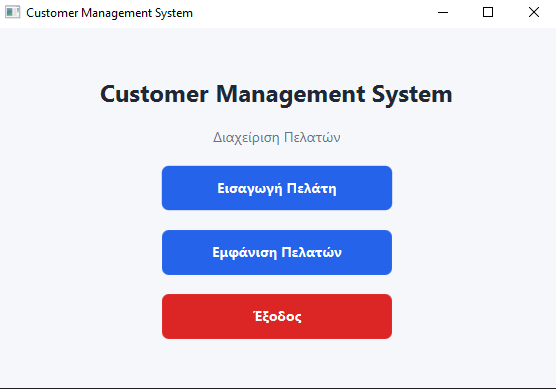
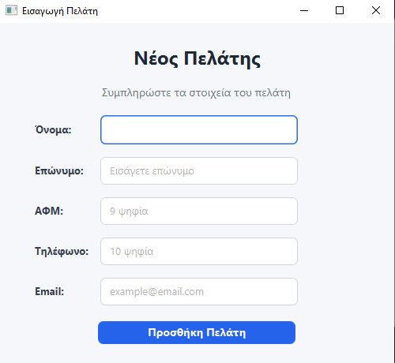
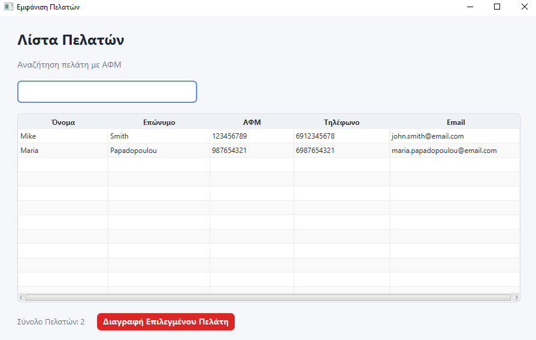

# Customer Management System

A desktop customer management application developed with **JavaFX** and **MySQL**.

The application provides a modern and user-friendly interface that allows users to create, view, edit, search, and delete customer information. All customer data is stored persistently in a MySQL database using JDBC.

---

## Features

- Add new customers
- View all customers
- Edit customer information directly from the table
- Delete customers with confirmation
- Search customers by Tax ID (AFM)
- Sort customer records by any column
- Input validation
  - Tax ID (9 digits)
  - Phone Number (10 digits)
  - Email Address
- Persistent data storage using MySQL
- Modern JavaFX interface with CSS styling

---

## Technologies

- Java 11
- JavaFX
- FXML
- CSS
- MySQL
- JDBC

---

## Screenshots

### Main Menu



### Add Customer



### Customers List



---

## Project Structure

```text
Customer-Management-System
│
├── database
│   ├── schema.sql
│   └── seed.sql
│
├── screenshots
│   ├── add-customer.png
│   ├── customers-list.png
│   └── main-menu.png
│
├── lib
├── nbproject
├── src
│   └── com
│       └── dimitris
│           └── customermanagement
│               ├── controller
│               ├── database
│               ├── model
│               ├── view
│               └── Main.java
│
├── .gitignore
├── README.md
├── build.xml
└── manifest.mf
```

---

## Database

The application uses a **MySQL** database to store customer information. Database creation scripts and sample data are included in the `database` folder.

The `customers` table contains the following fields:

| Field | Description |
|-------|-------------|
| customer_id | Customer ID |
| first_name | First Name |
| last_name | Last Name |
| tax_id | Tax ID (AFM) |
| phone | Phone Number |
| email | Email Address |

The `customer_id` is used internally to identify each customer during update and delete operations.

---

## Installation

1. Clone the repository.
2. Create a MySQL database.
3. Import `database/schema.sql`.
4. *(Optional)* Import `database/seed.sql`.
5. Configure the database connection in `DatabaseConnection.java`.
6. Run the application.

---

## Usage

- Add a new customer.
- View all customers.
- Search customers by Tax ID (AFM).
- Edit customer information.
- Delete selected customers.

---

## Author

**Dimitris Christodoulou**

Department of Informatics

University Project

2026